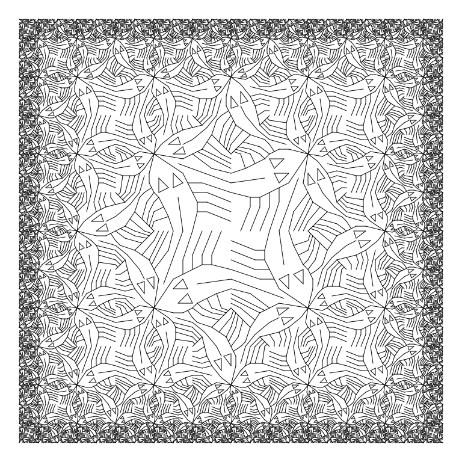

[](https://mhenderson.r-universe.dev/funcgeo)
[](https://zenodo.org/badge/latestdoi/72451164)

# funcgeo

The goal of **funcgeo** is to reproduce, using R, all pictures from the
following two papers of Peter Henderson:

  - [Henderson, P. (1982). *Functional
    Geometry*.](http://users.ecs.soton.ac.uk/peter/funcgeo.pdf)
  - [Henderson, P. (2002). *Functional
    Geometry*.](http://eprints.soton.ac.uk/257577/1/funcgeo2.pdf)

## Installation

You can install **funcgeo** from Github

``` r
remotes::install_github("MHenderson/funcgeo")
```

## Examples

``` r
library(funcgeo)

t <- quartet(fish_p, fish_q, fish_r, fish_s)
u <- cycle(rot(fish_q))

side1 <- quartet(nil, nil, rot(t), t)
side2 <- quartet(side1, side1, rot(t), t)

corner1 <- quartet(nil, nil, nil, u)
corner2 <- quartet(corner1, side1, rot(side1), u)

corner <- nonet(
  corner2, side2, side2,
  rot(side2), u, rot(t),
  rot(side2), rot(t), rot(fish_q)
)

squarelimit <- cycle(corner)
plot(squarelimit)
```

<!-- -->

To save a picture as SVG, use the `svg` device.

``` r
svg("fish.svg", width = 3, height = 3)
plot(quartet(fish_p, fish_q, fish_r, fish_s))
dev.off()
```

Please note that this project is released with a [Contributor Code of
Conduct](CONDUCT.md). By participating in this project you agree to
abide by its terms.
